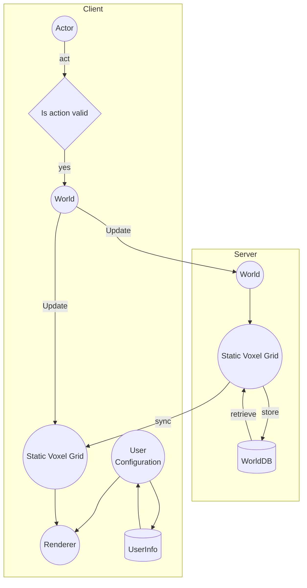
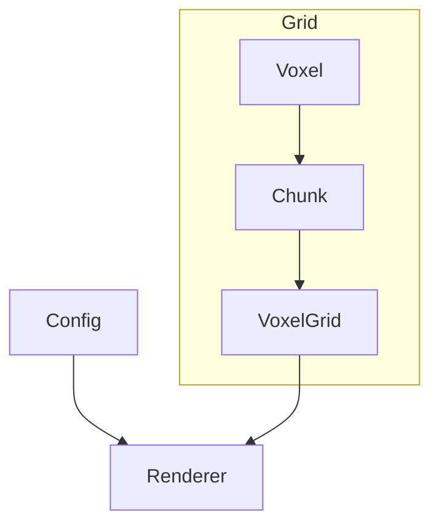
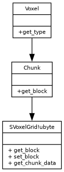

# API Documentation

## *TODO:*
- Think about the type to use for Chunks
- Implement configuration somewhere
- Player, Voxel and World are share in both server and client

# Server side
### *NOTE:*
I assume I will have server running in a different process and make
the client make "API" requests to get data from the server.

That said I don't know if sending binary data from an API is sensible...

## Voxel
A Voxel is the smallest unit in a [Static Voxel Grid](#staticvoxelgrid) and stores static data such as
the type of a voxel.

A Voxel must implement the following methods:
- `get_type`
- `get_color`
- `get_material`

## Block
I'm thinking of adding the concept of `block` or another type
that is basically a collection of 3d grid of voxels.

## Chunk
Represents a small 3d slice of the world. Usually stored fully on memory. A
Chunk can be modified but it's modifications don't affect the [Voxel Grid] they
are only stored locally in a chunk instance.

If you want to update the world to reflect the changes in a Chunk see
[SVGrid.set_chunk](set_chunk).

***NOTE***:

The purpose of this abstraction is to allow for a more efficient and cache
friendly way to get and modify multiple voxels in a chunk. Specially for the
Octree implementation.

### Methods:
#### get_block
**Arguments:**
- `cx`, `cy`, `cz` - Voxel position relative to the current Chunk.

**Return**:\
The [Voxel](voxel) at position `cx`, `cy`, `cz` if position is in chunk bounds, otherwise
Null.

## StaticVoxelGrid
*TODO*:
- Perhaps add a `load_chunk` function

A `StaticVoxelGrid!T` or `SVGrid` for short contains all [static voxels](#static-voxels) of [Voxel](#voxel) type
`T`.
### Methods:
#### get_chunk_data
**Description**:\
Get [chunk](chunk) at chunk position `cx`, `cy`, `cz`.

**Arguments:**
- `cx`, `cy`, `cz` - Position of the chunk to retrieve

**Return**:\
A [Chunk](chunk).

#### get_block
**Arguments**:
- `x`, `y`, `z` - coordinates of the block to retrieve
#### set_block
**Arguments**:
- `x`, `y`, `z` - coordinates of the block to retrieve
- `block` - Block to set

## Player
### Methods
#### move
**Arguments**:
- `direction`

#### mine_block
**Arguments**:
- `direction`

## World
### Methods
#### try_act
**Arguments**:
- `Player player`
- `Action action`

#### tick
**Description**:
Update world state, run physics, run entities

# Client side
## WorldRenderer
Render a static [WorldData](#world_data)

### Methods:
#### render_world
**Arguments**:
- `grid` - [SVGrid](#staticvoxelgrid) to render

#### render_chunk
**Arguments**:
- `world_data` - [SVGrid](#staticvoxelgrid) to render
- `x`, `y`, `z` - Chunk position

### TODO:
Change this diagram from flowchart to something else

